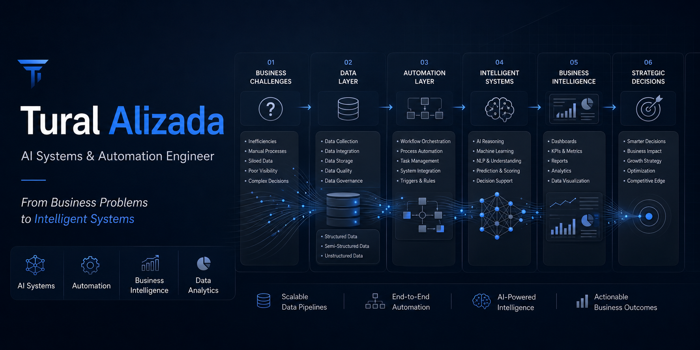

<p align="center">
  
</p>

## Building Intelligent Business Systems

I design and build intelligent business systems that combine Artificial Intelligence, Workflow Automation, Data Analytics, and Business Intelligence to solve real-world operational challenges.

My focus is not only building software, but creating systems that improve decision-making, automate repetitive processes, and transform business operations through technology.

---

## Core Expertise


---

## Technology Ecosystem

### Programming & Development


### AI & Automation


### Data & Business Intelligence


### Platforms & Databases


---

## Featured Projects

### Business Operations AI Platform

AI-powered business operating system designed to automate workflows, reporting, analytics, employee management, and intelligent decision support.

**Status:** Active Development

### AI Accounting Assistant

Intelligent accounting platform focused on financial reporting, automation, analytics, and operational efficiency.

**Status:** Planning & Architecture

### Legal AI Assistant

AI-powered legal workflow support system for research, document analysis, knowledge retrieval, and operational assistance.

**Status:** Planning & Architecture

### Medical AI Assistant

Healthcare-focused intelligent assistant for information analysis, workflow support, and decision assistance.

**Status:** Planning & Architecture

### AutoConnect

Automation-driven service marketplace platform connecting customers, providers, workflows, and business operations.

**Status:** Planning & Architecture

### LifeOS AI

AI-powered personal operating system designed to manage goals, productivity, routines, knowledge, and decision-making.

**Status:** Planning & Architecture

---

## System Thinking

```text
Business Problems
        ↓
Data Layer
        ↓
Automation Layer
        ↓
AI Systems
        ↓
Business Intelligence
        ↓
Strategic Decisions
```

---

## Current Roadmap

* Building AI-powered business systems
* Developing workflow automation solutions
* Creating intelligent decision-support platforms
* Designing business intelligence ecosystems
* Expanding AI agent capabilities
* Connecting operations, analytics, and automation

---

## Connect

📍 Warsaw, Poland

💼 Open to Remote Opportunities

🔗 LinkedIn:
[www.linkedin.com/in/tural-alizada-590514376](http://www.linkedin.com/in/tural-alizada-590514376)

---

### From Business Problems to Intelligent Systems
